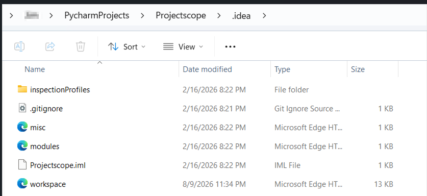
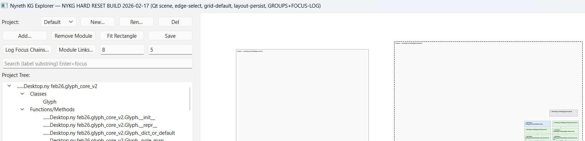
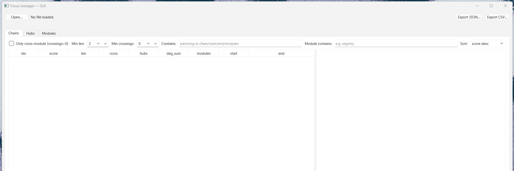

# Projectscope - prototype system to turn a codebase into an intelligent KG.

## created: 16 Feb 2026, by JL Kosev-Lex

Projectscope and its partner interpreter program were built on 16 Feb 2026, using ChatGPT, to turn my large and complex Nyreth codebase into a navigable knowledge graph, where the relationships between different parts of code; major functions, across modules - could be clearly delineated and interacted with. That is why you will notice the term 'focus lineages' appearing in the script.

The program would highlight how the code connects, and the data could be refined, and allow specific focus on the relevant parts being worked on. The compression factor is also friendly for LLM assistance, as the traversal of graphs is efficient, and a common factor in my other projects, such as the original Nyreth demo which was released in April 2025.

Screenshots proving date of origination:

<figure style="width: 560px; max-width: 100%"></figure>

<figure style="width: 560px; max-width: 100%"></figure>

<figure style="width: 560px; max-width: 100%"></figure>

projectscope gui

<figure style="width: 560px; max-width: 100%"></figure>

interpreter gui 
 

As some may recognise, something similar emerged in early April 2026. Therefore, this code is being made available as open source software under Apache 2.0 terms.

9 August 2026
